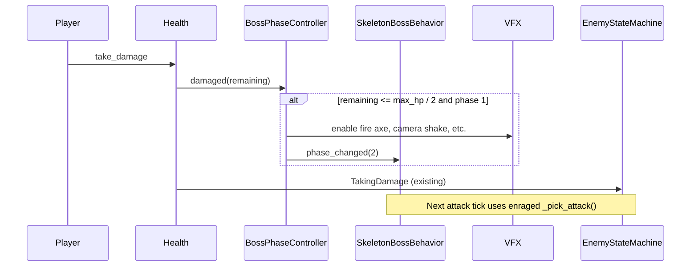

# Boss phase system — design spec

This document describes how **multi-phase bosses** will work in **Arm Carriers**, using the skeleton golem boss (`enemy_boss.tscn`) as the first implementation. It is a design spec only; implementation follows this document.

**First consumer:** skeleton boss enrage at 50% HP — flaming axe, slam attack, fire trails on normal swings.

---

## Goal

Bosses can become **stronger or change behavior** when their health crosses authored thresholds (e.g. below half HP). Phase changes should feel dramatic for two-player coop: readable telegraphs, shared risk (fire trails, wider threats), and clear visual feedback (flaming axe, UI beat).

**In scope (v1 — skeleton boss)**

- Reusable **phase controller** driven by `Health.damaged` thresholds.
- One-shot transition per threshold (e.g. 50% → phase 2, never re-triggers).
- Phase-aware **attack selection** in existing boss behavior (same behavior node, different tables).
- Phase 2 skeleton boss features:
  - Axe on fire (particles + **Blender-authored blade material**).
  - New **slam** attack (`Melee_2H_Slam`, already in animation library).
  - **Fire trails** on slash/stab that linger as ground hazards.
- Optional polish: boss health bar flash at phase boundary.

**Out of scope (v1)**

- Detachable body parts with separate health pools.
- Cloud sync or save-file persistence of “boss phase reached.”
- Generic boss editor UI; thresholds are exported on the controller per boss scene.
- Phase-specific music stems (can hook `phase_changed` later).
- Network/multiplayer boss authority (local coop only today).

---

## How the game works today (relevant pieces)

### Enemy core

- **`EnemyLocal`** — locomotion, health binding, animation tree, `_find_behavior()` caches the first `EnemyBehavior` child in `_ready()`.
- **`Health`** — `max_hp`, `current_hp`, signals `damaged(amount, remaining, source_position)` and `died(source_position)`.
- **`EnemyStateMachine`** — each frame: `behavior.tick()` → apply locomotion intent → `current_state.physics_update()` → `move_and_slide()`.
- **`EnemyBehavior` / `EnemyIntent`** — behavior writes `move_direction`, `face_direction`, `requested_locomotion`, `requested_attack` each tick.

### Skeleton boss today

| Piece | Location | Notes |
|-------|----------|--------|
| Scene | `src/enemy/enemy_boss.tscn` | Extends `EnemyLocal`; `max_hp = 60`. |
| Behavior | `SkeletonBossBehavior` | Chase + slash/stab in range; `_pick_attack()` is 50/50 random. |
| Attacking state | Shared `attacking.gd` | Only `&"slash"` and `&"stab"`; fires AnimationTree one-shots. |
| AnimationTree | Under `Skeleton_Golem` | One-shots: Slash, Stab. **Slam not wired.** |
| Weapon hitbox | `BoneAttachment3D/HitBox` | `hit_box.gd`; follows axe bone. |
| Body touch hitbox | Root `HitBox` | Instant kill via `_on_hit_box_body_entered`. |
| Axe mesh | `Skeleton_Golem_Axe` | **Two material slots** from Blender (blade + handle); handle keeps skeleton albedo, blade gets fire emission in DCC. |
| Anim library | `golem_boss` | Includes `Melee_2H_Slam.res` but unused in blend tree. |
| Boss UI | `show_boss_health_bar.gd` | Binds `BossHealthBar` to boss `Health` on fight start. |

### Damage and hit reactions

On `health.damaged`, `EnemyLocal` triggers hit flash and transitions to **`TakingDamage`**. Attacking is not a valid resume state after hit (`_can_resume_after_hit` excludes `"attacking"`).

**Implication:** phase transition at 50% may fire **during** `TakingDamage`. Design must choose whether enrage applies immediately or after hit recovery (see [Phase transition timing](#phase-transition-timing)).

---

## Design principles

1. **One behavior node per boss, phase as state** — Do not swap `EnemyBehavior` children at runtime; `EnemyLocal` caches behavior once. Phase changes attack tables and tuning inside the same script (or a small config resource), not a second behavior node.

2. **Threshold logic lives outside behavior** — A dedicated **`BossPhaseController`** listens to `Health`, crosses thresholds once, emits signals, and drives VFX/audio. Behavior **reads** current phase; it does not own HP math.

3. **Reuse existing pipelines** — Locomotion still goes `behavior → intent → state machine`. Attacks still go `intent.requested_attack → Attacking state → AnimationTree`. New attacks extend that path; do not bypass the state machine.

4. **Separate combat hazards from AI** — Fire trails are **linger hazards** spawned during attack windows, not behavior `_think()` logic. Keeps hazard timing aligned with animation frames.

5. **Coop-readable threats** — Phase 2 increases area denial (trails, slam AoE). Telegraphs and VFX should read at coop camera distance; avoid invisible hitboxes.

6. **Stable extension for future bosses** — Phase controller is generic (exported threshold list). Per-boss behavior and per-boss attacking state (or attack registry) carry boss-specific moves.

---

## Architecture overview

```
EnemyBoss (EnemyLocal)
├── Health
├── BossPhaseController          ← NEW: thresholds, phase_changed signal, enrage VFX hook
├── SkeletonBossBehavior         ← EXTEND: phase-aware _pick_attack(), tuning
├── EnemyStateMachine
│   ├── Attacking                ← EXTEND or boss variant: slash / stab / slam
│   └── …
├── Skeleton_Golem
│   ├── AnimationTree            ← EXTEND: Slam one-shot node
│   └── Rig_Large / … / BoneAttachment3D
│       ├── Skeleton_Golem_Axe   ← Blender blade/handle slots; enable fire on blade at phase 2
│       ├── HitBox (weapon)
│       └── FireAxeVFX           ← GPUParticles3D on axe (toggle emitting on phase 2)
└── …
```

### Data flow at 50% HP



---

## Components to add or extend

### 1. `BossPhaseController` (new node)

**Path:** `src/enemy/boss/boss_phase_controller.gd`  
**Parent:** child of boss root (sibling of `Health`, `SkeletonBossBehavior`).

| Responsibility | Detail |
|----------------|--------|
| Threshold config | `@export var phases: Array[BossPhaseThreshold]` or simple `@export var enrage_hp_ratio := 0.5` for v1. |
| Listen | Connect to parent `Health.damaged` in `_ready()`. |
| Cross once | When `remaining <= threshold`, advance phase and emit **`phase_changed(phase_index)`**. Guard with `_has_triggered` flags. |
| VFX hook | Optional `@export` node paths: axe mesh, particle root, audio. Controller enables particles and **blade fire material** on transition. |
| Query API | `get_current_phase() -> int`, `is_phase_at_least(n) -> bool` for behavior and hazards. |

**Does not:** pick attacks, play animations, or write files.

Suggested v1 threshold struct:

```gdscript
# boss_phase_threshold.gd (optional small resource)
@export var hp_ratio: float = 0.5   # trigger when remaining / max_hp <= this
@export var phase_index: int = 2
```

For skeleton boss v1, a single exported `enrage_hp_ratio := 0.5` on the controller is enough; generalize to an array when a second boss needs multi-step phases.

### 2. `SkeletonBossBehavior` (extend)

Read phase from `BossPhaseController` (cached reference in `_ready()`).

| Phase | Behavior changes (authored defaults) |
|-------|-------------------------------------|
| 1 | Current: slash/stab 50/50, `attack_cooldown = 1.5`. |
| 2 | Weighted `_pick_attack()`: slash, stab, **slam**; shorter cooldown (e.g. 1.0); optional tighter `attack_max_distance` or faster chase — tune in playtest. |

Keep `_think()` structure; only `_pick_attack()` and exported tuning differ by phase (either duplicate exports with `_get_attack_cooldown()` helper or `@export_group` per phase).

### 3. Attacking state (extend or boss variant)

Shared `attacking.gd` today maps two attacks to two AnimationTree params. Options:

| Option | Pros | Cons |
|--------|------|------|
| **A. Boss-specific state** (`skeleton_boss_attacking.gd`) | Clear, no risk to grunts | Duplication |
| **B. Generic attack registry** on state | One state, data-driven | Slightly more abstraction |
| **C. Extend shared state with optional slam** | Minimal files | Shared state grows with every boss attack |

**Recommendation:** **A for v1** — replace `Attacking` script on `enemy_boss.tscn` only. Add constants for `ANIM_PARAM_SLAM_*` and branch in `_play_attack_animation` / `_get_attack_animation_active`.

Slam must use existing library clip: `golem_boss/Melee_2H_Slam`.

### 4. AnimationTree (enemy_boss.tscn)

Mirror Slash/Stab pattern:

- Add `Slam` `AnimationNodeOneShot` + `Slam anim` → `Melee_2H_Slam`.
- Wire into blend tree (same layer priority as Stab).
- Expose parameters: `parameters/Slam/request`, `internal_active`.

### 5. Weapon hitbox timing

Weapon `HitBox` on `BoneAttachment3D` uses `hit_box.gd`. Enable/disable windows should match swing frames.

- Add **animation tracks** on slash, stab, and slam clips in `AnimationPlayer` (path: `Rig_Large/Skeleton3D/BoneAttachment3D/HitBox:monitoring`), **or**
- Drive monitoring from attacking state with frame timers (less ideal, duplicates art timing in code).

Prefer animation tracks for consistency with existing RESET track pattern in the scene.

Phase 2 may increase **`damage`** on `hit_box.gd` export or add fire DoT via a separate hazard — decide in implementation (see [Fire trails](#6-fire-trail-hazard-new)).

### 6. Fire trail hazard (new)

**Path:** `src/enemy/boss/fire_trail_hazard.gd` + scene, or `src/vfx/fire_trail_segment.tscn`.

| Aspect | Detail |
|--------|--------|
| Trigger | Attacking state (phase 2 only), during slash/stab active window — spawn segments at axe global position on an interval. |
| Behavior | Short-lived `Area3D` or mesh + area; damages `PlayerLocal` on overlap; optional visual (particles/decal). |
| Lifetime | 2–4 s authored; must not stack infinitely (cap active segments or use single trail per swing). |
| Coop | Telegraph with visible fire on ground; damage should feel fair with dash/i-frames if players have them. |

**Not** implemented inside `SkeletonBossBehavior._think()`.

Emitter placement: child of `BoneAttachment3D` or referenced from attacking state via boss node path.

### 7. Flaming axe (visual)

**v1 (this version — Blender materials):**

1. **`GPUParticles3D`** on the axe bone — toggle `emitting` when phase 2 starts; primary flame read.
2. **Split axe materials in Blender** before export:
   - **Handle** — existing skeleton albedo (bone wrap).
   - **Blade** — separate material with orange/red **emission** (and any metal roughness you want when idle).
3. **Godot runtime** — on enrage, enable fire on the **blade surface only** (e.g. `set_surface_override_material(blade_index, fire_material)` or toggle `emission_enabled` on the exported blade `StandardMaterial3D`). Do **not** replace the whole mesh with a single `material_override`; the handle must stay on the skeleton slot.

**Art export notes:**

- Assign material slots in Blender so the imported `ArrayMesh` has stable surface indices (document blade index in scene notes).
- Re-export `Skeleton_Golem_Axe` into the boss scene; remove any whole-mesh `material_override` once per-surface materials are wired.
- Optional: author a dull “cold blade” and bright “enraged blade” as two `.tres` files and swap only the blade surface override at phase 2; or one blade material with emission toggled in code.

`BossPhaseController` (or a tiny `BossAxeVisuals` helper) performs **particle toggle + blade-surface fire** on `phase_changed`.

Do not rely on `HitFlash3D` for sustained fire — that overlay is hit-feedback only and clears after 0.5 s.

Do not use a full-mesh `material_overlay` for enrage — that was an interim Godot-only approach; **blade/handle split in Blender is the source of truth for this version.**

### 8. Boss health bar (optional polish)

`BossHealthBar` already listens to `damaged`. On `BossPhaseController.phase_changed`, optionally:

- Flash bar color (e.g. orange border).
- Brief scale punch on icon.

Connect from level wiring or have bar listen to controller if exposed on boss root.

---

## Skeleton boss — phase 2 spec

| Feature | Implementation owner | Acceptance |
|---------|------------------------|------------|
| Enrage at 30 HP (50% of 60) | `BossPhaseController` | Fires once; axe VFX on; behavior uses phase 2 table. |
| Flaming axe | Blender blade material + particles on `Skeleton_Golem_Axe` | Blade glows; handle unchanged; readable at normal camera zoom. |
| Slam attack | AnimationTree + boss attacking state + hitbox tracks | Boss performs slam in phase 2; damages players in arc. |
| Fire trails on slash/stab | `FireTrailHazard` + attacking state | Phase 2 slash/stab leave ground fire; phase 1 does not. |
| Cooldown / aggression | `SkeletonBossBehavior` exports | Phase 2 feels noticeably pressure-heavy in 2p coop. |

Suggested phase 2 attack weights (starting point, tune in playtest):

| Attack | Weight |
|--------|--------|
| slash | 35% |
| stab | 35% |
| slam | 30% |

---

## Phase transition timing

Two valid behaviors; pick one during implementation and document in scene notes.

| Mode | Behavior | Best when |
|------|----------|-----------|
| **Immediate** | On `damaged`, if threshold crossed, fire `phase_changed` before or regardless of `TakingDamage`. | Dramatic mid-fight enrage; axe lights up while boss is still reacting to hit. |
| **Deferred** | Queue enrage until `TakingDamage` exits (listen to state machine or `resume_state_after_hit`). | Avoid overlapping hit anim with slam windup; safer animation-wise. |

**Recommendation for v1:** **Immediate** VFX (axe fire, screen feedback) with **deferred** first slam (behavior picks slam only after boss returns to idle/running). Prevents slam clipping out of hit stun without delaying the visual enrage.

---

## File checklist (implementation)

| Action | Path |
|--------|------|
| Add | `src/enemy/boss/boss_phase_controller.gd` |
| Add | `src/enemy/boss/fire_trail_hazard.gd` (+ optional `.tscn`) |
| Art | Blender — split axe mesh materials (blade fire + handle skeleton); re-export to boss scene |
| Add (optional) | `assets/material/characters/skeleton_golem_axe_blade_fire.tres` — only if not fully embedded in `.glb` |
| Extend | `src/enemy/behavior/skeleton_boss_behavior.gd` |
| Add | `src/enemy/state/skeleton_boss_attacking.gd` (or extend `attacking.gd` on boss only) |
| Edit | `src/enemy/enemy_boss.tscn` — controller node, AnimationTree slam, axe VFX, per-surface blade material hook |
| Optional | `src/world/ui/boss_health_bar.gd` — phase flash |

---

## Implementation order

1. **`BossPhaseController`** — threshold, signal, debug print at 50%.
2. **Behavior phase read** — `_pick_attack()` returns different set when phase ≥ 2 (still slash/stab only).
3. **Slam** — AnimationTree + boss attacking state + hitbox tracks; add slam to phase 2 weights.
4. **Axe fire** — Blender blade/handle materials + particles; controller enables blade fire + particles on `phase_changed`.
5. **Fire trails** — hazard scene + spawn from attacking state in phase 2.
6. **Tuning pass** — cooldown, trail lifetime, slam damage, coop playtest.
7. **UI polish** — health bar enrage flash (optional).

---

## Testing plan

- [ ] Phase 1 only: boss never slams, no fire axe (particles off, blade emission off), no trails; dies normally above 50%.
- [ ] Crossing 50% exactly once: enrage VFX (particles + blade glow), phase 2 attacks enabled; dropping below 50% again does not re-trigger.
- [ ] Burst damage 31 → 29 in one hit: still enrages correctly.
- [ ] Enrage during `TakingDamage`: VFX immediate; no stuck state; resume to idle/running.
- [ ] Phase 2 slam: hitbox active only during slam window; damages both players if coop spacing is wrong.
- [ ] Fire trails: damage after swing; expire; performance OK with repeated slash/stab.
- [ ] Boss health bar tracks HP through phase change; optional flash works.
- [ ] Death from phase 2: dead state, no trail/hazard leaks after `queue_free`.

---

## Future extensions

- **Multi-threshold phases** — array on controller (66% / 33%); behavior tables per phase index.
- **Detachable parts** — separate `Health` on sub-nodes, damage routing, disable attacks when part destroyed; out of v1 scope.
- **Shared `BossAttackConfig` resource** — maps `StringName` → animation param + hazard prefab for data-driven bosses.
- **Level events** — `phase_changed` could drive camera focal point or music via signal connection in `world_boss_scene.tscn`.

---

## Open questions

1. **Blade surface index** — after Blender export, which `ArrayMesh` surface index is the blade? (Document on `Skeleton_Golem_Axe` in the scene.)
2. **Slam range** — should boss move during slam or root in place? (Animation is likely rooted; confirm in editor.)
3. **Fire trail damage** — same as axe hitbox tick damage or lighter DoT?
4. **Player invulnerability** — do players have i-frames after hit that trails should respect? (Check `Health.grant_invulnerability` usage on players.)
5. **Deferred vs immediate enrage** — confirm feel in first playtest; adjust per [Phase transition timing](#phase-transition-timing).

---

## Related docs

- Level wiring: `docs/level-authoring.md`
- Boss health UI: `src/world/ui/show_boss_health_bar.gd`, `boss_health_bar.gd`
